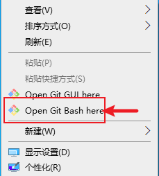
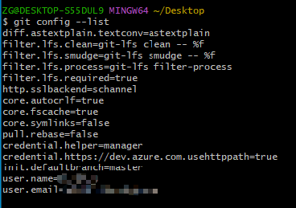
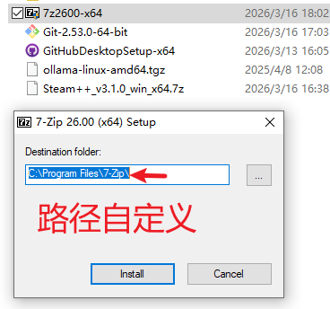
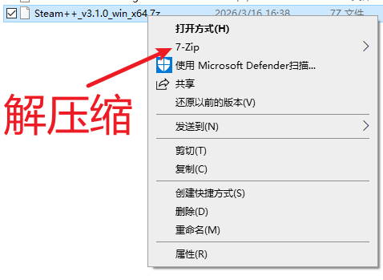
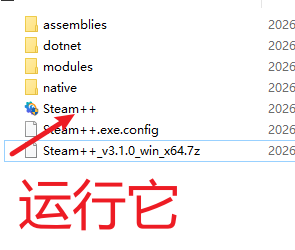
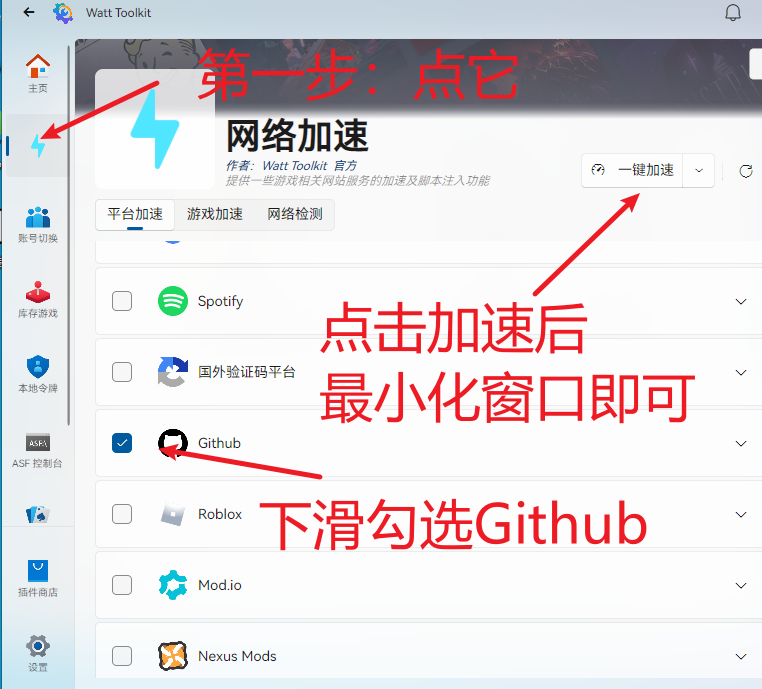
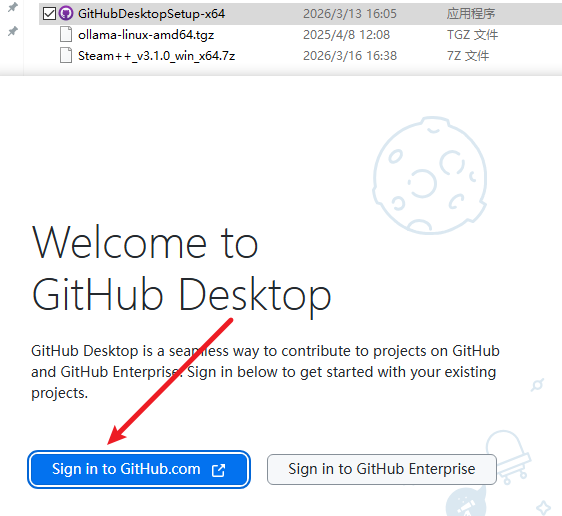
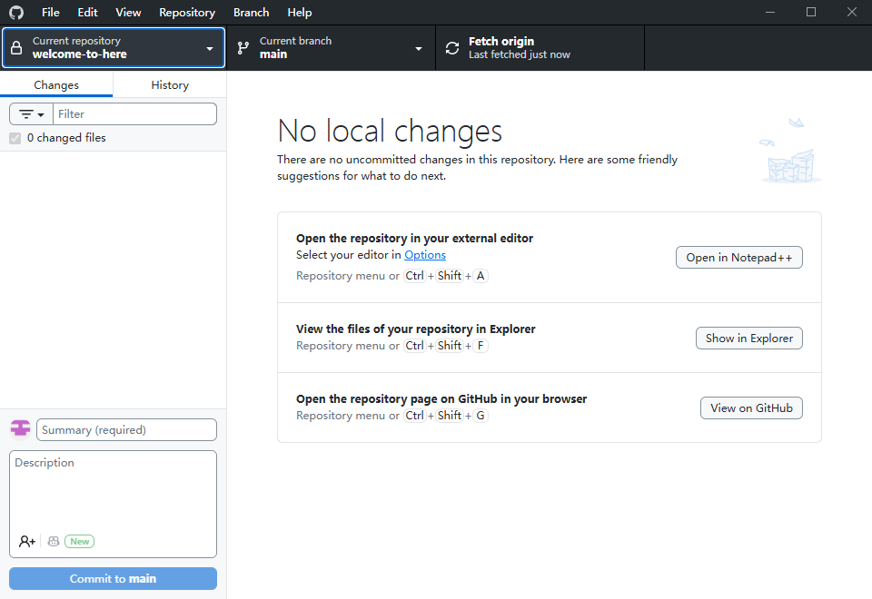

# VariousSoftwareSystem

## 项目前置说明

使用IDE：Visual Studio Code；IDEA

（默认开发环境已搭建完成，未完成请自行搜索教程）

项目管理工具：Git；GitHub Desktop

IDE中的插件：Vite、Vuetify、Vue、Vue Router、Pinia、Vitepress、Spring Boot、Node.js、NPM、Yarn

部署服务器：Vercel

数据库：MySQL

---

## 环境搭建

### 一、Git 安装与配置

1. Git安装包获取：登录学习通资料进行下载
2. Git安装步骤：
[Git安装步骤](https://www.bilibili.com/video/BV15SwJzBEa6?t=86.6 "点击观看")（建议两倍速看完）
3. Git配置步骤:
  - 桌面右键 Git Bash Here  
  
  - 配置邮箱和用户名（鼠标中键粘贴）
  > #配置用户名 
git config --global user.name "test"

  > #配置邮箱 
git config --global user.email  abc@163.com

<mark>这里的用户名与邮箱建议与GitHub注册账号保持一致</mark>

 > #查看配置信息 
git config --list

4. [其它Git命令参考](https://www.jianshu.com/p/93318220cdce "点击查看")

### 二、GitHub 账号注册

1. 登录学习通资料下载7-zip解压缩软件并安装  
   
2. 登录学习通资料下载Steam++加速器，右键选择7-zip解压缩，解压缩到任意目录下  
     
   双击运行  
     
   主界面进行操作  
     
   <mark>**访问Github以及使用Github DeskTop软件时都需要打开Steam++进行加速操作**</mark>
3. 注册GitHub账号，URL: https://github.com/

### 三、GitHub Desktop 安装与使用

1. GitHub Desktop安装包获取：登录学习通资料进行下载
2. 双击安装包，点击登录GitHub账号  
     
3. 登录后界面如下：  
     
4. GitHub Desktop使用步骤：[视频教程](https://www.bilibili.com/video/BV13W411U7HY?t=43.2 "点击观看")  
   多人协作开发：[视频教程](https://www.bilibili.com/video/BV1Enw8zMEk1?t=688.7 "点击观看")  
    <mark>请各位注册完Github账号后把邮箱发给我，我邀请你们进行协作开发。 </mark> 
    
   <mark>**注意：请确保代码正确能运行再提交仓库！！！我没时间一个一个看是不是对的！**</mark>
   