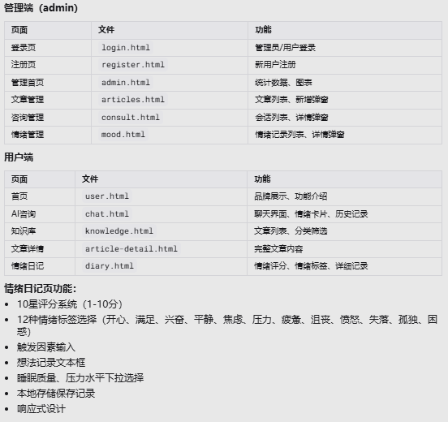

# 心理健康AI助手 - 产品需求文档 (PRD)

## 文档信息

| 项目 | 内容 |
|------|------|
| 产品名称 | 心理健康AI助手 |
| 版本 | V1.0 |
| 编写日期 | 2026-04-09 |
| 状态 | 初稿 |

---

## 1. 项目概述

### 1.1 项目背景

在现代社会中，心理健康问题日益突出，但专业心理咨询资源有限且存在门槛。许多人因为时间、费用、隐私顾虑等原因无法获得及时的心理支持。本项目旨在通过AI技术，为用户提供一个7×24小时在线、私密、温暖的心理健康陪伴平台。

### 1.2 产品定位

**一次温暖的对话，化孤独为慰藉**

- **目标用户**: 需要情感支持、心理疏导的普通大众
- **核心价值**: 即时陪伴、情绪记录、心理知识普及
- **差异化**: AI+真人咨询结合，提供多层次支持

### 1.3 产品愿景

让每个深夜、每个焦虑的时刻，都有人（AI）陪伴。不必独自承受，让心与心的连接温暖用户的每一天。

---

## 2. 用户角色

### 2.1 角色定义

| 角色 | 描述 | 主要功能 |
|------|------|----------|
| **普通用户** | 寻求心理支持和陪伴的个人 | AI对话、情绪记录、浏览知识库、预约咨询 |
| **咨询师** | 专业心理咨询师 | 回复咨询、发布文章、查看预约 |
| **管理员** | 平台运营管理人员 | 数据监控、内容管理、用户管理 |

### 2.2 用户画像

#### 普通用户 - 小李
- **年龄**: 25-35岁
- **职业**: 都市白领
- **痛点**: 工作压力大、焦虑失眠、无处倾诉
- **需求**: 随时可倾诉的对象、情绪释放出口、简单的心理调节方法

#### 咨询师 - 王医生
- **背景**: 国家二级心理咨询师
- **需求**: 高效管理来访者、分享专业知识、在线接单

---

## 3. 功能需求

### 3.1 功能架构图

```
心理健康AI助手
├── 用户端（C端）
│   ├── 首页
│   ├── AI对话
│   ├── 情绪日志
│   ├── 知识库
│   └── 个人中心
├── 咨询师端（B端）
│   ├── 咨询管理
│   ├── 文章发布
│   └── 个人排班
└── 管理后台
    ├── 数据分析
    ├── 知识库管理
    ├── 咨询记录
    └── 用户管理
```


### 3.2 功能模块详述

#### 3.2.1 首页（Landing Page）

**功能描述**: 产品入口页面，展示品牌价值和核心功能入口

**页面元素**:
| 元素 | 说明 | 优先级 |
|------|------|--------|
| 导航栏 | Logo、首页、知识库、登录、注册 | P0 |
| 主标语 | "一次温暖的对话，化孤独为慰藉" | P0 |
| 副标题 | 产品价值描述 | P0 |
| CTA按钮 | "开始谈话，获得陪伴"、"记录心情，释放情感" | P0 |
| 品牌插图 | 机器人形象 | P1 |

**交互逻辑**:
- 点击"开始谈话" → 跳转AI对话页面（需登录）
- 点击"记录心情" → 跳转情绪日志页面（需登录）
- 点击"登录/注册" → 跳转对应页面

---

#### 3.2.2 登录/注册模块

**登录页面**:
| 字段 | 类型 | 必填 | 验证规则 |
|------|------|------|----------|
| 电子邮件 | 输入框 | 是 | 邮箱格式 |
| 密码 | 密码框 | 是 | 6-20位字符 |
| 记住我 | 复选框 | 否 | - |

**注册页面**:
| 字段 | 类型 | 必填 | 验证规则 |
|------|------|------|----------|
| 用户名 | 输入框 | 是 | 2-20位字符 |
| 电子邮件 | 输入框 | 是 | 邮箱格式，唯一 |
| 密码 | 密码框 | 是 | 6-20位，需含字母+数字 |
| 手机号 | 输入框 | 是 | 11位手机号 |
| 确认密码 | 密码框 | 是 | 与密码一致 |
| 用户类型 | 下拉选择 | 是 | 普通用户/咨询师 |

**交互逻辑**:
- 表单实时验证
- 提交后显示加载状态
- 错误时显示具体错误信息
- 注册成功后自动登录并跳转首页

---

#### 3.2.3 AI对话模块

**功能描述**: 用户与AI助手进行文字对话，获得情感支持

**核心功能**:
| 功能 | 说明 | 优先级 |
|------|------|--------|
| 文字对话 | 支持与AI实时文字聊天 | P0 |
| 情绪识别 | AI识别用户情绪状态 | P1 |
| 建议推送 | 根据对话内容推送调节建议 | P1 |
| 对话历史 | 保存并展示历史对话记录 | P1 |

**对话流程**:
1. 用户进入对话页面
2. 显示欢迎语和引导问题
3. 用户输入消息
4. AI分析并回复
5. 循环直至用户结束对话

---

#### 3.2.4 情绪日志模块

**功能描述**: 用户记录每日情绪状态，追踪情绪变化趋势

**功能点**:
| 功能 | 说明 | 优先级 |
|------|------|--------|
| 情绪评分 | 1-10分情绪打分 | P0 |
| 情绪标签 | 选择情绪类型（开心、焦虑、沮丧等） | P0 |
| 文字记录 | 记录当天发生的事情和感受 | P1 |
| 趋势图表 | 展示情绪变化趋势 | P1 |
| 提醒功能 | 定时提醒记录情绪 | P2 |

---

#### 3.2.5 知识库模块

**功能描述**: 心理健康知识文章库，支持分类浏览和搜索

**用户端功能**:
| 功能 | 说明 | 优先级 |
|------|------|--------|
| 文章列表 | 展示所有已发布文章 | P0 |
| 分类筛选 | 按焦虑、抑郁、压力等分类筛选 | P0 |
| 搜索功能 | 关键词搜索文章 | P0 |
| 文章详情 | 阅读完整文章内容 | P0 |
| 收藏功能 | 收藏喜欢的文章 | P1 |

**文章分类**:
- 焦虑管理
- 抑郁认知
- 压力应对
- 睡眠改善
- 冥想正念
- 自我成长
- 职场心理
- 人际关系

---

#### 3.2.6 数据分析模块（管理后台）

**功能描述**: 为管理员提供平台运营数据可视化分析

**统计指标**:
| 指标 | 说明 | 展示方式 |
|------|------|----------|
| 总用户数 | 平台注册用户总数 | 数字卡片 |
| 活跃用户 | 近7天活跃用户 | 数字卡片 |
| 情绪日志数 | 用户情绪记录总数 | 数字卡片 |
| 咨询会话数 | AI对话和真人咨询总数 | 数字卡片 |
| 平均情绪 | 平台用户平均情绪评分 | 数字卡片 |
| 情绪趋势 | 时间维度的情绪变化 | 折线图 |
| 咨询活动 | 会话数量、参与用户数 | 柱状图 |
| 用户活跃度 | 活跃用户、新增用户趋势 | 面积图 |

**时间维度**:
- 今日
- 近7天
- 近30天
- 自定义时间段

---

#### 3.2.7 知识库管理模块

**功能描述**: 管理员/咨询师管理知识库文章

**功能列表**:
| 功能 | 说明 | 优先级 |
|------|------|--------|
| 文章列表 | 展示所有文章，支持分页 | P0 |
| 新增文章 | 创建新文章 | P0 |
| 编辑文章 | 修改已有文章 | P0 |
| 删除文章 | 删除文章（软删除） | P0 |
| 发布/下架 | 控制文章显示状态 | P0 |
| 筛选搜索 | 按分类、状态、关键词筛选 | P0 |

**文章字段**:
| 字段 | 说明 |
|------|------|
| 文章标题 | 必填，最大100字符 |
| 作者 | 自动填充当前用户 |
| 分类 | 单选，预设分类 |
| 内容 | 富文本编辑器 |
| 浏览量 | 自动统计 |
| 发布时间 | 自动记录 |
| 状态 | 已发布/草稿 |

---

## 4. 非功能需求

### 4.1 性能需求

| 指标 | 要求 |
|------|------|
| 页面加载时间 | 首屏 < 2秒，完整加载 < 5秒 |
| API响应时间 | 平均 < 300ms，P99 < 1秒 |
| 并发用户 | 支持 1000+ 同时在线 |
| AI响应时间 | 首次响应 < 3秒 |

### 4.2 安全需求

| 需求 | 说明 |
|------|------|
| 数据加密 | 用户密码加盐哈希存储，敏感信息加密 |
| 会话管理 | JWT Token，支持自动续期 |
| 隐私保护 | 对话内容加密存储，仅用户本人可查看 |
| 访问控制 | 基于角色的权限控制 (RBAC) |
| 防攻击 | 防SQL注入、XSS、CSRF |

### 4.3 可用性需求

| 需求 | 说明 |
|------|------|
| 响应式设计 | 适配PC、平板、手机 |
| 浏览器兼容 | Chrome、Firefox、Safari、Edge 最新2个版本 |
| 无障碍支持 | 支持屏幕阅读器，键盘导航 |
| 多语言 | 中文为主，预留国际化接口 |

### 4.4 可靠性需求

| 需求 | 说明 |
|------|------|
| 系统可用性 | 99.9% |
| 数据备份 | 每日全量备份，实时增量备份 |
| 故障恢复 | RTO < 1小时，RPO < 5分钟 |

---

## 5. 界面原型

### 5.1 页面清单

| 页面 | 文件 | 角色 |
|------|------|------|
| 首页 | index.html | 游客/用户 |
| 登录页 | login.html | 游客 |
| 注册页 | register.html | 游客 |
| 知识库管理 | knowledge.html | 管理员 |
| 数据分析 | dashboard.html | 管理员 |

### 5.2 设计规范

**色彩系统**:
```
主色: #5a9a8f (绿色 - 健康、平静)
主色深: #4a857a
主色浅: #6bada2
强调色: #f5c842 (黄色 - 温暖、希望)
背景色: #f5f5f5
文字色: #333333 (主文字)
       #666666 (次要文字)
       #999999 (辅助文字)
```

**字体规范**:
- 中文: -apple-system, "PingFang SC", "Microsoft YaHei"
- 英文: -apple-system, BlinkMacSystemFont, "Segoe UI", Roboto
- 基础字号: 14px
- 标题层级: 20px → 18px → 16px → 14px

**间距规范**:
- 基础单位: 8px
- 常用间距: 8px, 16px, 24px, 32px, 48px
- 页面边距: 24px (PC), 16px (移动端)

---

## 6. 技术要求

### 6.1 前端技术栈

| 技术 | 说明 |
|------|------|
| HTML5 | 页面结构 |
| CSS3 | 样式，使用Flexbox/Grid布局 |
| JavaScript | 交互逻辑 |
| 图表库 | ECharts 或 Chart.js |
| 图标 | Font Awesome |

### 6.2 后端技术栈（建议）

| 技术 | 说明 |
|------|------|
| 语言 | Node.js / Python / Go |
| 框架 | Express / Django / Gin |
| 数据库 | PostgreSQL (主库) + Redis (缓存) |
| AI服务 | Claude API / OpenAI API |
| 部署 | Docker + Kubernetes |

### 6.3 接口规范

- 协议: RESTful API
- 数据格式: JSON
- 认证方式: Bearer Token (JWT)
- API版本: /api/v1/

---

## 7. 项目排期

### 7.1 里程碑

| 阶段 | 时间 | 目标 |
|------|------|------|
| M1 | 第1-2周 | 完成原型设计和需求评审 |
| M2 | 第3-4周 | 完成前端页面开发 |
| M3 | 第5-6周 | 完成后端API开发 |
| M4 | 第7周 | 集成测试和Bug修复 |
| M5 | 第8周 | 上线部署 |

### 7.2 优先级定义

- **P0**: 核心功能，必须完成
- **P1**: 重要功能，建议完成
- **P2**: 增值功能，可选完成

---

## 8. 风险评估

| 风险 | 可能性 | 影响 | 应对措施 |
|------|--------|------|----------|
| AI回复质量不稳定 | 中 | 高 | 设置敏感词过滤，人工审核机制 |
| 用户隐私担忧 | 中 | 高 | 明确隐私政策，数据加密存储 |
| 咨询纠纷 | 低 | 高 | 免责声明，保留对话记录 |
| 技术实现复杂度 | 中 | 中 | 分阶段迭代，MVP优先 |

---

## 9. 附录

### 9.1 术语表

| 术语 | 说明 |
|------|------|
| AI对话 | 用户与AI助手的文字交流 |
| 情绪日志 | 用户记录情绪状态的功能 |
| RBAC | 基于角色的访问控制 |
| JWT | JSON Web Token，用于身份认证 |
| MVP | 最小可行产品 |

### 9.2 参考文档

- 原型文件: index.html, login.html, register.html, knowledge.html, dashboard.html
- 样式文件: styles.css

### 9.3 变更记录

| 版本 | 日期 | 变更内容 | 作者 |
|------|------|----------|------|
| V1.0 | 2026-04-09 | 初稿创建 | - |

---

**文档结束**
